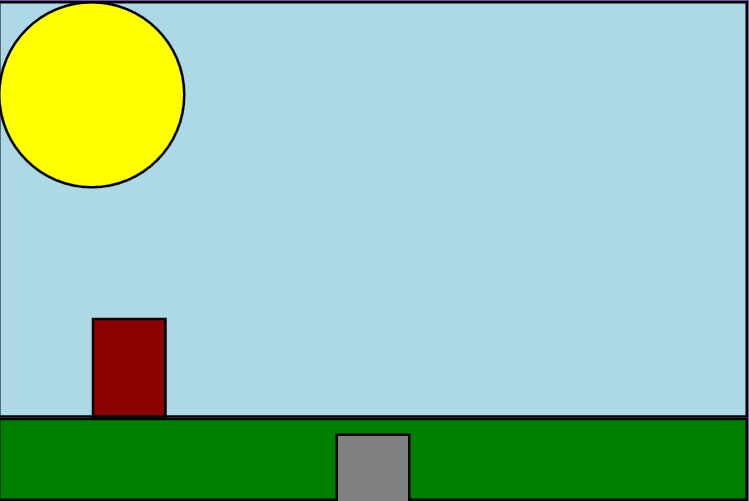

<h1 align="center">
  Projeto Jogo DOOM
</h1>

 

  

## 📝 Descrição 

Projeto pessoal, desenvolvimento de um jogo simples de tiro ao alvo em primeira pessoa, aos moldes de jogos retro pré renderização 3D:

- Calculo de Colisões
- Randomização de posições
- Loops de jogo
- rotação de 360º simulada

Notas: 

Em breve com interface gráfica e arte repaginada (ainda trabalhando na SpriteSheet)

## 🚀 Linguagens
Esse projeto foi desenvolvido com as seguintes Linguagens:

  </a>

## 📚 Bibliotecas e Ferramentas

- [Microsoft Small Basic](https://smallbasic-publicwebsite.azurewebsites.net)
- [Asesprite](https://www.aseprite.org)

## 🔗 Links

 

 

 

 
## 💻 Colaboradores 
<table>
  <tr>
    <td align="center">
      <a href="https://www.linkedin.com/in/nycolasagrgarcia/">
         
        
          <b>Nycolas Garcia</b>
        
      </a>
  </tr>
</table>

-----

<h3 align="center"> Desenvolvido por <a href="https://www.linkedin.com/in/NycolasAGRGarcia/">Nycolas Garcia</a> ☕</h3>
